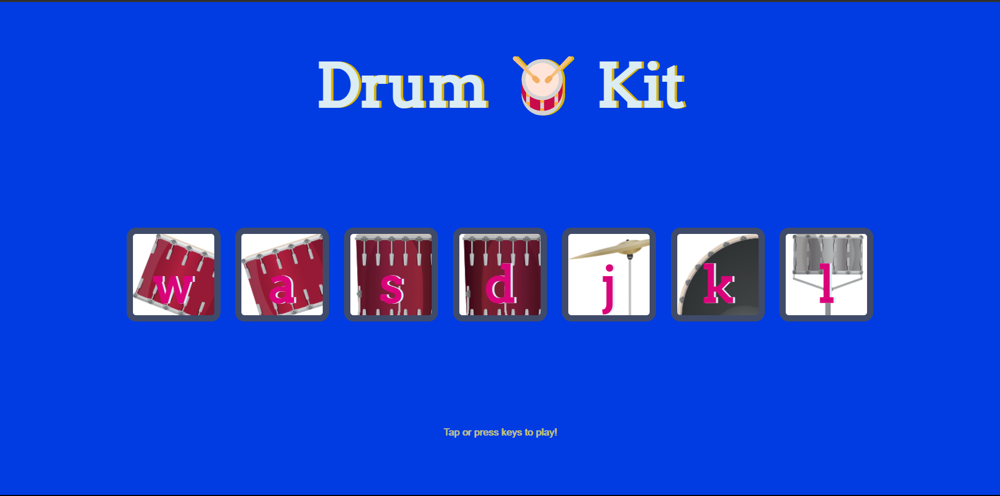

#  Drum Kit

A fun and interactive web-based drum kit that lets you play drum sounds with your keyboard or by clicking on the drum pads. This project is part of Angela Yu's Web Development Bootcamp.

##  Live Demo

Check out the live demo of the project [here](https://drum-kick-project.vercel.app/).



##  Description

This project is a simple yet engaging drum kit application built with HTML, CSS, and JavaScript. It allows users to play various drum sounds by either clicking on the corresponding drum pads on the screen or by pressing the associated keys on their keyboard. The application also features a "combo" effect that is triggered when a certain number of keys are pressed within a short amount of time, adding a fun and rewarding element to the user experience.

##  Features

*   **Interactive Drum Pads:** Click on the drum pads to play different drum sounds.
*   **Keyboard Support:** Use your keyboard to play the drums. The keys 'w', 'a', 's', 'd', 'j', 'k', and 'l' are mapped to different drum sounds.
*   **Visual Feedback:** When a drum pad is played, it visually changes to provide feedback to the user.
*   **Combo Effect:** A "combo" effect is triggered when you press 10 keys within 4 seconds, displaying a fiery "🔥 Combo! 🔥" message on the screen.
*   **Responsive Design:** The layout of the drum kit is responsive and adapts to different screen sizes.

##  How to Play

1.  **Click:** Click on the drum pads on the screen to play the corresponding drum sounds.
2.  **Keyboard:** Use the following keys on your keyboard to play the drums:
    *   **w:** Tom 1
    *   **a:** Tom 2
    *   **s:** Tom 3
    *   **d:** Tom 4
    *   **j:** Crash
    *   **k:** Kick-Bass
    *   **l:** Snare

##  Technologies Used

*   **HTML:** For the structure of the web page.
*   **CSS:** For styling the drum kit and adding visual effects.
*   **JavaScript:** For the functionality of the drum kit, including event handling, audio playback, and the combo effect.

##  File Structure

```
Drum Kit Starting Files/
├── index.html
├── index.js
├── styles.css
├── images/
│   ├── crash.png
│   ├── kick.png
│   ├── snare.png
│   ├── tom1.png
│   ├── tom2.png
│   ├── tom3.png
│   └── tom4.png
└── sounds/
    ├── crash.mp3
    ├── kick-bass.mp3
    ├── snare.mp3
    ├── tom-1.mp3
    ├── tom-2.mp3
    ├── tom-3.mp3
    └── tom-4.mp3
```

##  Getting Started

To get a local copy up and running, follow these simple steps.

### Prerequisites

You will need a web browser to run this project.

### Installation

1.  Clone the repo
    ```sh
    git clone https://github.com/FiyinfoluwaDav/Drum-Kick-Project.git
    ```
2.  Open the `index.html` file in your web browser.

##  License

This project is licensed under the MIT License - see the [LICENSE.md](LICENSE.md) file for details.


